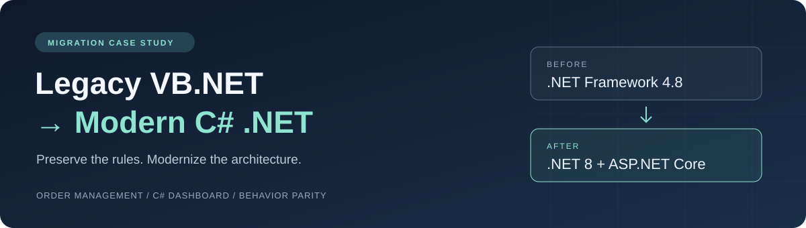
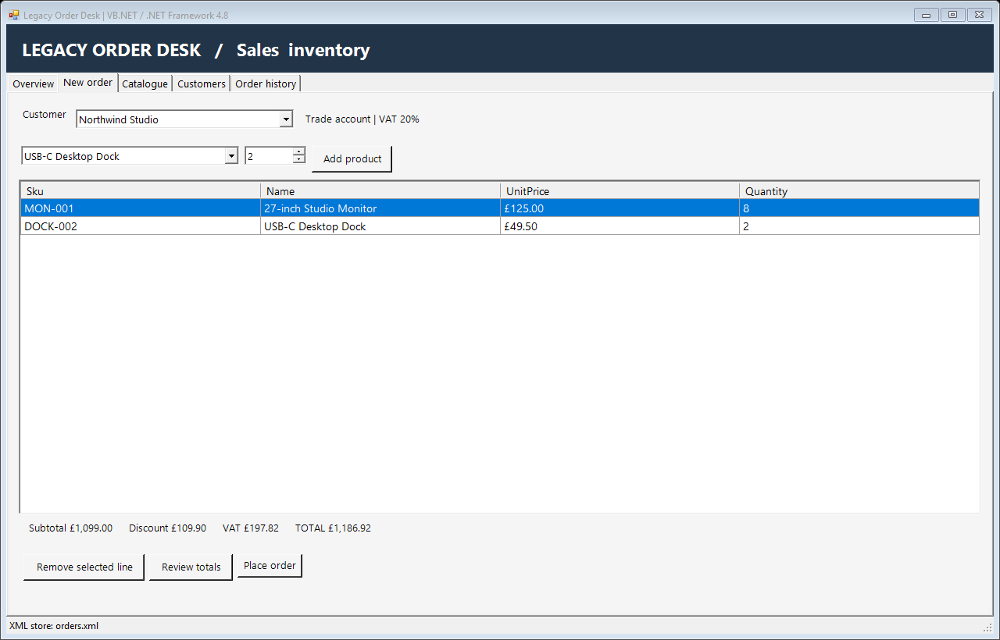
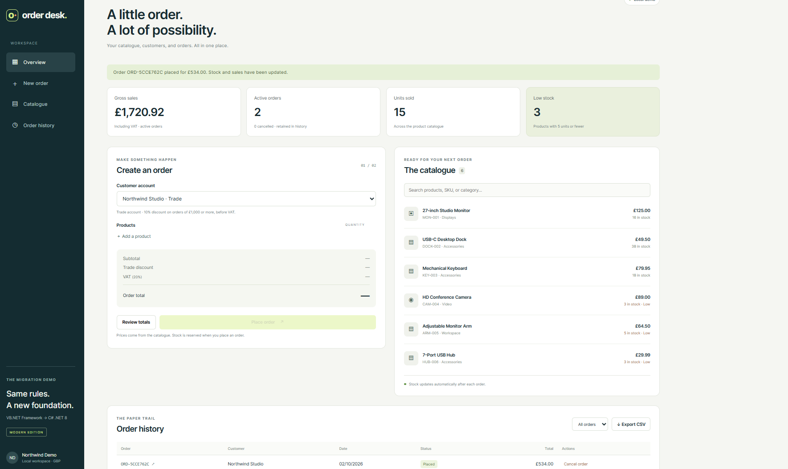
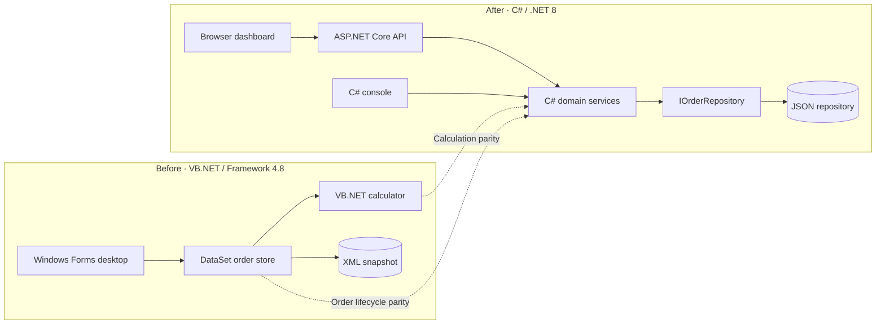

<p align="center">
  
</p>

# Legacy VB.NET → Modern C# .NET

**Two working order-management applications. One set of business rules.**

A portfolio case study migrating a VB.NET / .NET Framework 4.8 application to a C# / .NET 8 application. Both versions manage products, customer profiles, orders, stock, sales reports, and CSV exports. The modern version adds a responsive browser dashboard and an ASP.NET Core API.

The modern application's domain, persistence, API, and CLI are **all C#**. Its browser frontend is plain HTML/CSS/JavaScript. VB.NET remains in the legacy application and the test-only baseline used to verify the translation.

| Legacy VB.NET desktop | Modern C# dashboard |
|---|---|
| [](docs/legacy-desktop.png) | [](docs/dashboard.png) |

*Actual application screenshots with synthetic sample data. Click either image to view it at full size. This is a purpose-built portfolio demo, not a claimed client project.*

## Two solutions

| Open in Visual Studio | Application |
|---|---|
| [LegacyInvoices.sln](LegacyInvoices.sln) | VB.NET Windows Forms desktop application on .NET Framework 4.8 |
| [MigrationDemo.sln](MigrationDemo.sln) | Modern C# domain, infrastructure, API, CLI, and migration checks |

For the modern dashboard, set **ModernInvoices.Api** as the Startup Project. For the legacy application, set **LegacyInvoices.Desktop** as the Startup Project. If Visual Studio kept an older startup selection, right-click the desired project in Solution Explorer and choose **Set as Startup Project**, then press F5.

The legacy solution contains two projects: **LegacyInvoices.Desktop** and **LegacyInvoices.Business**. If Visual Studio reports that `Global.LegacyInvoices.OrderStore` is undefined, close the solution and reopen this repository's `LegacyInvoices.sln` so Visual Studio loads the **LegacyInvoices.Business** reference. The desktop project can also be checked independently with `msbuild legacy/LegacyInvoices.Desktop/LegacyInvoices.Desktop.vbproj /t:Rebuild /p:Configuration=Debug`.

## Features you can demonstrate

| Feature | Legacy VB.NET | Modern C# |
|---|---|---|
| Searchable catalogue | Desktop grid | CLI, API, dashboard |
| Retail/trade customer profiles | Three seeded profiles | Same three profiles |
| Catalogue-based quotes | Desktop order builder | Server-priced order builder |
| Discount and VAT calculation | Original decimal calculator | C# translation with 2,000 comparisons |
| Stock validation | Before saving | Before saving, HTTP 409 on conflict |
| Place an order | Saves order and deducts stock | Saves order and deducts stock |
| Cancel an order | Restores stock once | Same rule, plus dashboard action |
| Order history | Desktop customer/status filters and saved-line detail | Customer API filter, status UI filter, detail dialog |
| Sales report | Desktop metrics | CLI/API summary and dashboard metrics |
| CSV export | Desktop file export | CLI output and browser download |
| Persistence | DataSet + XML with schema | JSON repository behind an interface |
| Historic prices | Saved order-line snapshot | Immutable C# record snapshot |
| Presentation | Windows Forms desktop | Interactive command menu + responsive dashboard |

Customer profiles are demo pricing accounts, not sign-in accounts. The catalogue and profiles are seeded, read-only data; stock changes through orders.

## Run the modern application

Install the [.NET 8 SDK](https://dotnet.microsoft.com/en-us/download/dotnet/8.0), version 8.0.400 or newer. From the repository root:

```sh
dotnet restore MigrationDemo.sln --configfile NuGet.Config
dotnet build MigrationDemo.sln -c Release --no-restore --warnaserror
dotnet run --project src/ModernInvoices.Api -c Release --no-build
```

Open **http://localhost:5080**. Select a customer, edit the basket, choose **Review totals**, and then **Place order**. The history, stock, and sales figures update. Click an order ID to see its saved lines, or cancel it to restore stock.

The initial basket is 8 monitors at £125 and 2 docks at £49.50. For the trade customer it produces:

```text
Subtotal: 1099.00
Discount: 109.90
VAT: 197.82
Total: 1186.92
```

No database installation, account, secret, third-party NuGet package, or frontend build is required. `NuGet.Config` clears package sources because only SDK/framework assemblies are used; add a source if you introduce packages.

**Runtime choice:** .NET 8 matches the development environment and remains supported until **10 November 2026**. For a long-lived deployment, upgrade to .NET 10 LTS. The repository currently targets and tests .NET 8; see Microsoft's [support policy](https://dotnet.microsoft.com/en-us/platform/support/policy/dotnet-core).

## Run the legacy application

Use Windows with Visual Studio or Build Tools, MSBuild, and the **.NET Framework 4.8 targeting pack**. Open `LegacyInvoices.sln`, set **LegacyInvoices.Desktop** as the Startup Project, and press F5. If Visual Studio says the startup project cannot be launched, reopen the solution and choose **Set as Startup Project** on **LegacyInvoices.Desktop**. To build and launch the desktop app from a Developer PowerShell:

```powershell
msbuild LegacyInvoices.sln /p:Configuration=Release
./legacy/LegacyInvoices.Desktop/bin/Release/LegacyInvoices.Desktop.exe
```

In the desktop app, select a customer, add products, review the totals, and place an order. The confirmation, order history, stock figures, report, and CSV export can all be inspected there. Run the C# dashboard afterwards to compare the same workflow. The modern solution also includes an optional C# command menu:

```sh
dotnet run --project src/ModernInvoices.Cli -c Release --no-build -- --interactive
```

## Where the data lives

| Application | Default location | Override |
|---|---|---|
| Legacy desktop | `data/orders.xml` beside its executable | `LEGACY_DATA_FILE` environment variable |
| Modern CLI | `data/orders.json` beside its executable | `MODERN_DATA_FILE` environment variable |
| Modern API | `src/ModernInvoices.Api/data/orders.json` when started with `dotnet run` | `--DataFile` argument or `DataFile` environment variable |

Directories and data files are created as needed. A quote is read-only; the first successful place/cancel mutation saves the entire state. Restarting the application reloads it. Each application starts with its own store, so a CLI order does not automatically appear in the API. To demonstrate CLI/API access to the same JSON file, point both at the same absolute path **and run them sequentially**.

Each store is designed for **one application process per data file**. The modern API serializes concurrent requests through one repository instance and replaces the saved snapshot only after a transaction succeeds. Multiple processes or replicas require a database. The demo does not import an existing legacy XML file into modern JSON.

## API examples

Use [samples/requests.http](samples/requests.http), or run:

```sh
curl -H "Content-Type: application/json" --data-binary @samples/catalogue-order.json http://localhost:5080/api/orders
```

On Windows PowerShell use `curl.exe`, or:

```powershell
Invoke-RestMethod http://localhost:5080/api/orders `
  -Method Post -ContentType 'application/json' `
  -Body (Get-Content samples/catalogue-order.json -Raw)
```

| Method | Route | Purpose |
|---|---|---|
| GET | `/health` | Health check |
| GET | `/api/products?search=monitor` | Catalogue search |
| GET | `/api/customers` | Seeded customer profiles |
| POST | `/api/orders/quote` | Price a basket without reserving stock |
| POST | `/api/orders` | Save an order; returns 201 and its location |
| GET | `/api/orders?customerId=CUST-001` | Order history |
| GET | `/api/orders/{id}` | Saved line prices and totals |
| POST | `/api/orders/{id}/cancel` | Cancel and restore stock |
| GET | `/api/reports/sales` | Active sales and inventory summary |
| GET | `/api/exports/orders.csv` | Download all order history |
| POST | `/api/invoices/quote` | Original arbitrary-price calculator example |

Validation errors return **400**, missing customer/product/order records return **404**, and insufficient stock or repeated cancellation returns **409**. The order endpoints accept SKUs and quantities and obtain prices from the catalogue; the original calculator route does not persist orders or touch stock.

## Business rules

- Trade accounts get 10% off when the subtotal reaches £1,000. Retail accounts get no discount.
- The example VAT rate is 20% of the discounted subtotal. These are synthetic demo rules, not a tax engine.
- Discount and VAT use decimal arithmetic, rounded to two decimal places with midpoint values rounded away from zero.
- An invoice/order contains 1–100 lines. Each quantity is 1–10,000; catalogue orders also require available stock and unique SKUs.
- Unit prices are between 0 and 1,000,000 with at most two decimal places. Orders save the catalogue name and price at placement.
- A quote does not reserve stock. Placement validates stock again. A cancelled order stays in history, contributes no sales, and can be cancelled only once.
- Low stock means 5 units or fewer. Sales totals include placed orders only; CSV exports include cancelled history too.

## Verification

After the Release build:

```sh
dotnet run --project tests/MigrationChecks -c Release --no-build
pwsh -File scripts/Test-Api.ps1
```

On Windows with the legacy targeting tools:

```powershell
pwsh -File scripts/Test-Legacy.ps1
```

| Check | Evidence |
|---|---|
| Core runner: 21 groups | Known totals, threshold/rounding, 2,000 generated invoice comparisons, validation, and SOLID contract checks |
| Order parity | Matching seeded catalogues, quotes, saved orders, stock deductions, cancellations, reports |
| Persistence | Reopening both stores, rejected orders leave files unchanged, historic prices remain intact |
| Concurrency | 12 requests for the last 3 hubs accept exactly 3 orders |
| HTTP integration | Dashboard served; real Kestrel requests verify totals, order lifecycle, 400/404/409, and CSV |
| Legacy desktop build | Windows script builds the .NET Framework 4.8 Windows Forms app in Debug and Release and checks its executable and symbols |
| Design contracts | JSON/in-memory substitution, read-only query dependencies, replaceable pricing policies, fixed clock, and CSV escaping/culture |

The check runner is an executable that exits nonzero on failure: **use `dotnet run`, not `dotnet test`**. Its behavior comparisons compile the legacy business-rule source into `tests/LegacyBaseline` on .NET 8. The Windows script checks that the actual .NET Framework desktop app builds; it does not automate the Windows Forms UI. Open both applications to compare their interfaces manually.

[GitHub Actions](.github/workflows/ci.yml) runs the modern build/checks on Windows and Ubuntu and builds the legacy desktop app on Windows. The PowerShell scripts require [PowerShell 7](https://github.com/PowerShell/PowerShell). Check the workflow page for the latest run status.

## Architecture

The modern code applies **SOLID** with focused services, separate query/report/export classes, replaceable pricing policies, and storage abstractions owned by Core. Read-only queries depend on `IOrderReader`; order processing depends on `IOrderRepository` and `IInvoiceCalculator`. The API and CLI choose the concrete implementations at startup. See [SOLID design and evidence](docs/SOLID.md) for the mapping, contracts, tests, and limits.



```text
LegacyInvoices.sln                 VB.NET Framework desktop solution
MigrationDemo.sln                  Modern C# solution + verification baseline
legacy/LegacyInvoices.Desktop/     Windows Forms order management interface
legacy/LegacyInvoices.Business/    VB.NET pricing and DataSet/XML order rules
src/ModernInvoices.Core/           C# policies, order service, queries, storage contracts
src/ModernInvoices.Infrastructure/ C# JSON repository, CSV exporter, demo seed data
src/ModernInvoices.Api/            C# endpoints + wwwroot dashboard
src/ModernInvoices.Cli/            C# command menu
tests/LegacyBaseline/             Test-only linked legacy VB.NET source
tests/MigrationChecks/            C# behavior and persistence checks
scripts/                          Real HTTP checks and legacy desktop build check
samples/                          HTTP and JSON examples
```

Read the [migration walkthrough](docs/MIGRATION.md) for design decisions and the [five-minute demo guide](docs/DEMO.md) for presenting the work.

## Scope and future extensions

This demo shows a language/runtime migration, separation of concerns, persistence, an order workflow, a usable UI, and behavioral evidence. It has no authentication, payments, shipping, editable product/customer administration, or deployment configuration. Use synthetic data locally.

Good next extensions are .NET 10, SQLite/EF Core with database transactions, an explicit legacy-data importer, customer/product editing, and a standard test framework with coverage reporting. Each can be introduced as a reviewable change against the existing behavior baseline.

## GitHub repository

The completed project is published at [RyanHB123/vbnet-to-csharp-migration](https://github.com/RyanHB123/vbnet-to-csharp-migration). Clone it to run the two solutions and follow the verification steps above.

## License

[MIT](LICENSE).
