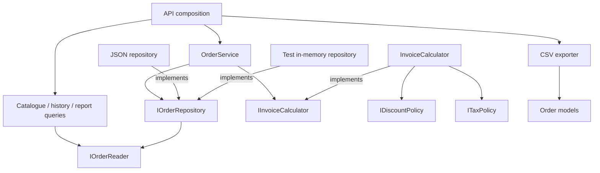

# SOLID in the modern C# application

The migration demonstrates SOLID through specific dependency boundaries and executable checks. The legacy VB.NET application remains the behavioral baseline. The modern application separates order processing, queries, reports, output formatting, pricing policy, and storage.

## Where each principle appears

| Principle | Implementation | Evidence |
|---|---|---|
| **S — Single Responsibility** | `OrderService` manages quoting, placement, and cancellation. `CatalogQueries` and `OrderQueries` retrieve data. `SalesReportQuery` calculates the report. `OrderCsvExporter` formats output. `JsonOrderRepository` handles persistence. | CSV formatting can be tested with supplied orders and no server or repository. Existing lifecycle and report checks exercise their separate classes. |
| **O — Open/Closed** | `InvoiceCalculator` accepts `IDiscountPolicy` and `ITaxPolicy`. Default implementations reproduce the legacy rules; another policy can be supplied at application startup. | A no-discount policy and a zero-tax policy produce a different quote and saved order without changing the calculator or order service. |
| **L — Liskov Substitution** | Every `IOrderRepository` implementation must preserve the same snapshot, transaction, failure, and concurrency semantics. | The same contract suite runs against the production JSON repository and a test-only in-memory implementation. Both also run the order lifecycle through the same service. |
| **I — Interface Segregation** | Read-only consumers accept `IOrderReader`, which exposes only `Read`. Order processing accepts `IOrderRepository`, which also supports transactions. Pricing has separate discount and tax contracts. | Catalogue, history, and reporting queries work with a test reader that has no write method. |
| **D — Dependency Inversion** | Core code owns `IInvoiceCalculator`, the pricing contracts, and the repository contracts. `OrderService` uses those abstractions plus .NET's `TimeProvider`. Infrastructure implements storage; application entry points choose implementations. | The Core project has no reference to Infrastructure, ASP.NET Core, or the legacy project. Tests supply alternative storage, policies, and a fixed clock. |

## Read the implementation

- [Order processing](../src/ModernInvoices.Core/OrderService.cs)
- [Catalogue queries](../src/ModernInvoices.Core/CatalogQueries.cs), [order queries](../src/ModernInvoices.Core/OrderQueries.cs), and [sales reporting](../src/ModernInvoices.Core/SalesReportQuery.cs)
- [Invoice calculator](../src/ModernInvoices.Core/InvoiceCalculator.cs) and [pricing contracts/default policies](../src/ModernInvoices.Core/PricingPolicies.cs)
- [Storage contracts](../src/ModernInvoices.Core/IOrderRepository.cs) and [JSON implementation](../src/ModernInvoices.Infrastructure/JsonOrderRepository.cs)
- [CSV exporter](../src/ModernInvoices.Infrastructure/OrderCsvExporter.cs)
- [API dependency registration](../src/ModernInvoices.Api/Program.cs)
- [SOLID checks](../tests/MigrationChecks/SolidChecks.cs) and [in-memory test repository](../tests/MigrationChecks/InMemoryOrderRepository.cs)

## Dependency direction



The API container registers `IOrderReader` as the same singleton instance used for `IOrderRepository`. This matters: independent repository instances would have independent locks. The API supplies dependencies at startup, so the Core library does not need to locate services itself.

## Repository substitution has a behavioral contract

An implementation must satisfy all of the following:

1. A read callback receives a detached snapshot. Mutating it does not save anything.
2. A successful update commits the whole state change.
3. A throwing callback commits nothing and propagates the original exception.
4. Objects returned or retained by callbacks cannot later mutate committed state, including nested order-line arrays.
5. Operations on one repository instance are serialized so concurrent requests cannot oversell stock.

Callbacks are synchronous, do not re-enter the repository, and do not launch work that retains the snapshot on another thread. The contract covers a single repository instance in one process. Cross-process coordination, crash durability, and database transaction isolation require additional design.

The contract suite checks read isolation, escaped references, rollback, exception propagation, nested result mutation, cancellation, and simultaneous requests for the last three stock units. The in-memory substitute copies state on both input and commit so it does not accidentally provide weaker semantics than the JSON adapter.

## Pricing extension example

The built-in policies are `TradeDiscountPolicy` and `StandardVatPolicy`. A different tax rule can implement the small contract:

```csharp
public sealed class ZeroTaxPolicy : ITaxPolicy
{
    public decimal CalculateTax(decimal taxableAmount) => 0m;
}
```

Choose it when composing the application:

```csharp
IInvoiceCalculator calculator = new InvoiceCalculator(
    new TradeDiscountPolicy(), new ZeroTaxPolicy());
```

Policies return unrounded amounts. The calculator owns calculation order and monetary rounding, preserving the legacy half-penny behavior. It rejects discounts outside zero-to-subtotal and negative tax values before an order can commit.

The extension check covers domain behavior. The dashboard labels describe the default 10% trade discount and 20% VAT, so changing application policy also requires updating that explanatory copy.

## Verification and deliberate limits

Run the checks after building:

```sh
dotnet run --project tests/MigrationChecks -c Release --no-build
pwsh -File scripts/Test-Api.ps1
```

On Windows, also run `pwsh -File scripts/Test-Legacy.ps1` to build the .NET Framework desktop app in Debug and Release. The full runner has 21 groups: 15 existing migration/workflow groups and 6 additional design-contract groups. The additional groups cover both repository implementations, alternative policies/clock, a reader without writes, invalid policy output, and CSV escaping/culture.

SOLID guides the boundaries here; it is not a certification of the entire application. The full-state repository is a deliberate simplification for a file-based demo. A database adapter must preserve transaction behavior, and a larger application may need a more focused unit-of-work model. Query and formatting classes remain concrete because their current consumers do not need interchangeable implementations. The legacy design is retained so reviewers can compare the architecture and verify behavior across the migration.
